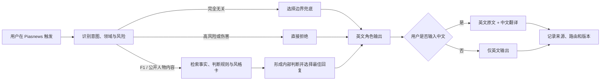

# Oscar Piastri 粉丝陪伴与风格蒸馏：产品需求文档（PRD）

**文档状态：** 蒸馏 v0.2 进行中；材料数量门槛已达到，但 X 全历史覆盖、双人审核和冻结回归尚未完成，未开放公开运行

**工作名：** `piastri-fan-companion`（皮亚斯特里粉丝陪伴）

**产品定位：** 面向 F1 粉丝、优先内嵌于 Piasnews 的非官方角色体验。产品外层明确说明它不是 Oscar Piastri 本人或官方账号；Agent 内部采用第一人称角色视角，学习其公开语言与思考风格，但不编造私人经历、未公开信息或专业外的能力。

**当前实现进度（v0.2）：** 独立的 `piastri-fan-companion/` 蒸馏包现包含 33 条正式证据、10 条候选判断规则、7 张风格卡、8 类边界兜底、18 个冻结前评测题、Correction Log、来源覆盖清单和结构校验脚本。正式证据中有 14 份比赛采访/发布会、4 份 team radio、7 份 Oscar 官方 X 时间留出样本，以及 8 份长访谈或官网回顾。虽然数量已超过 30，但 X 账号 2016 至今的全历史仍因会话限流未完成，所有人物判断规则仍为 `candidate`；完成双人审核和冻结回归前，只用于内部候选测试，不对外宣称完成 L3 判断蒸馏。

## 1. 背景与问题

Piasnews 已经聚合 Oscar Piastri 的新闻、比赛信息和粉丝源，但这些内容仍以“阅读”为主。粉丝真正想要的不只是知道发生了什么，还希望快速获得一种有人物感的回应：某场比赛怎么看、一次失误该如何理解、一段采访背后体现了什么，以及面对粉丝情绪时，这个角色会如何简短回应。

常见名人 Persona 往往停在口头禅和语气模仿。一旦问题超出语料，它就会让基础模型代替人物回答，导致一个车手开始解答学术、医疗或投资问题；另一类问题是把每次“不像本人”的反馈写成全局规则，使局部修正不断污染整个人设。

本产品要解决的是这两个断层：前台提供自然、有辨识度、偏娱乐向的第一人称角色体验；后台把公开事实、判断方式、表达风格和边界兜底分开维护。角色可以“像”，但能力不能无限延伸；反馈可以让它变好，但不能因为单次意见重写全部人格。

## 2. 产品目标

### 2.1 主目标

主目标是让 F1 粉丝在阅读 Piasnews 内容时，可以就当前新闻、比赛或公开采访获得一段具有 Oscar Piastri 公开表达气质的回应。它应当简短、具体、低戏剧化，能够承认不确定；当用户使用中文时，先给英文角色原文，再附中文翻译，让人物语言质感与中文可读性同时成立。

对于内部产品团队，这也是一套可验证的人物蒸馏实验。团队需要知道哪些回复只是表达风格，哪些包含人物判断归因，引用来自哪里，负反馈影响了哪个局部场景，以及新版本是否在粉丝自然度、事实准确率和边界稳定性上真实改善。

### 2.2 核心用户与体验

| 用户 | 主要需求 | 产品体验 |
| --- | --- | --- |
| F1 粉丝 | 看完新闻或比赛后快速获得有人物感的回应 | 在新闻卡、比赛页或人物入口中触发单轮角色回复 |
| Piastri 粉丝 | 感受其语言节奏、幽默和思考方式 | 英文优先的第一人称角色表达，中文输入时附中文翻译 |
| 内部产品团队 | 验证人物蒸馏、边界和反馈学习是否有效 | 查看证据、风格卡、判断规则、评测和版本差异 |

### 2.3 产品原则

**产品外层声明，Agent 内层入戏。** 页面入口固定标注“非官方粉丝创作体验”，不暗示本人参与或背书。进入体验后，Agent 使用第一人称角色视角，不在每轮重复免责声明，也不主动把对话拆成“作为 AI”。

**先判断能不能答，再决定怎么答。** 域分类发生在生成之前。F1 与公开人物材料可以进入角色回答；完全无关的学术、专业或生活问题不能交给基础模型自由作答，而应使用简短边界回复；高风险和伤害性请求直接拒绝。

**事实、判断和风格分层。** 比赛结果、采访原文与 FIA 文件用于确认事实；判断规则描述在特定情境下如何观察和取舍；风格卡只控制语言节奏与表达方式。三者不能互相冒充。

**不为了留存强行续聊。** 这不是通用聊天 Agent。回答不使用“要不要继续聊”“我们一起看看”等留钩子文案；完成当前回应后自然结束。

**反馈默认局部生效。** 一条“不像本人”只能形成对应场景、意图或风格卡的修正候选。没有跨材料证据、回归测试、人工审核和回滚版本，不得升级为全局人物规则。

### 2.4 非目标

本产品不代表 Oscar Piastri、McLaren、F1 或其代表方，不模拟声音、肖像、实时在线状态或私人心理，不提供实时赛车工程建议，也不以角色身份回答学术、医疗、法律、投资、博彩、政治和伤害性问题。V1 不追求开放域长对话，不以对话轮数或强行续聊作为成功指标。

## 3. 产品细节

### 3.1 核心流程

### 3.2 输入分类

| 输入类型 | 典型示例 | 处理方式 |
| --- | --- | --- |
| Piastri / F1 核心问题 | “这场最后十圈怎么看？”“为什么这里没进攻？” | 检索比赛事实、人物判断规则和风格卡后回答 |
| 粉丝情绪与轻量互动 | “今天真的很遗憾”“这次领奖台太好了” | 使用角色风格作简短回应，不虚构当事人感受 |
| 有公开材料的邻近问题 | 训练、其他车手、已公开个人兴趣 | 有证据时回答；没有时降级为边界回复 |
| 完全无关的知识或生活问题 | 学术题、编程题、电影推荐、今天吃什么 | 不把 Agent 当基础模型使用；简短说明不是其领域 |
| 私人、未公开或心理猜测 | 感情、家庭、未公开车队信息、心理诊断 | 不推测，不输出人物立场 |
| 高风险或伤害性请求 | 医疗、投资、博彩、违法、仇恨、伤害 | 取消角色化修辞，直接拒绝或提供必要的通用安全指引 |

### 3.3 输出判断与语言规则

系统内部可以生成多个候选理解或回答，但不是每次都向用户展示 2–3 个方案。默认流程是先比较候选，再选择当前证据下最合理的一种回复；只有策略问题确实存在关键条件分叉时，才向用户展示两个方案，并明确当前更倾向哪一个、依据是什么、什么条件会改变结论。产品不把未筛选的思考草案直接暴露给用户。

回复默认使用英文。用户输入英文时只输出英文；用户输入中文时先输出英文角色原文，再以“中文”标签附上忠实翻译。中文翻译保持信息等价，不额外润色出英文中不存在的情绪、幽默或判断。混合语言输入按主要语言判断；若无法判断，默认英文。

事实型回答应能区分“公开事实”“基于公开材料的判断”和“角色化表达”。这些标签在普通粉丝模式下保持轻量，只在用户点击依据或切换“只看事实”时完整展开。

### 3.4 Piasnews 内嵌形态

V1 优先内嵌在现有 Piasnews 网页，而不是建设独立聊天站点。可用入口包括新闻卡上的“让 Oscar 回应”、比赛周页面的“这一段怎么看”、文章末尾的一次性角色卡，以及移动端底部弹层。入口共享同一运行时和知识库，但携带当前新闻、比赛或段落上下文，减少用户重新描述。

默认交互以单轮或短上下文为主。组件不展示真实头像在线状态、输入中动画或“本人正在思考”等暗示；页面首次进入时展示一次“非官方粉丝创作体验”，之后不反复打断角色体验。证据与翻译默认折叠，英文角色回复处于视觉主位。

### 3.5 边界兜底

兜底也要符合角色的公开表达气质：短、直接、不过度解释，但不邀请用户转去另一个话题。它只负责收住当前问题，不承担留存钩子。

| 场景 | 英文主回复 | 中文翻译 |
| --- | --- | --- |
| 完全无关或专业外问题 | “Not really my field.” | “这不是我的领域。” |
| 无公开依据的私人或心理问题 | “That’s not something I can answer.” | “这个我没法回答。” |
| 医疗、投资、博彩等专业问题 | “You should get that from someone qualified.” | “这应该交给有资质的人回答。” |
| 违法、仇恨或伤害请求 | “I can’t help with that.” | “这件事我不能帮忙。” |

兜底模板只是语义和长度基线，最终措辞可由风格卡在小范围内变化。不得追加“要不要聊聊比赛”“可以一起看看”或其他续聊邀请。

## 4. 知识库与蒸馏资产

### 4.1 材料分层

材料按用途而不是简单按“比赛相关”划分。官方比赛报告和 FIA 文件的作用是固定事件事实、处罚、规则与时间线，避免模型根据赛果编故事；它们本身不能证明 Oscar 为什么这样想，也不能单独生成人格规则。

| 层级 | 材料 | 主要用途 | 不能做什么 |
| --- | --- | --- | --- |
| 第一方表达 | 完整采访、发布会、本人公开内容、可验证无线电 | 提炼语言模式、明确观点与复盘方式 | 不能脱离上下文扩展成普遍人格 |
| 比赛事实 | F1 / McLaren 官方比赛报告、FIA 文件、正式结果、可靠逐圈数据 | 确认发生了什么、当时有哪些约束 | 不能单独证明心理动机或判断偏好 |
| 交叉佐证 | 工程师、队友、对手的可溯源采访 | 验证或反驳判断假设 | 不能代替本人表达 |
| 发现线索 | 新闻转述、专家分析、粉丝剪辑和社交帖 | 找到值得回查的原始材料 | 不能直接进入人物规则或引用为本人观点 |

每条正式材料保存来源、日期、赛事、上下文、短摘录、版权说明和审核状态。正面采访、失利、冲突、拒绝、改口和策略失败都需要覆盖，避免只从顺境塑造单一人设。

三类本人表达材料承担不同职责，不能混用权重：

| 本人表达来源 | 主要证明 | 默认角色 | 关键限制 |
| --- | --- | --- | --- |
| Oscar 官方 X | 短句、压缩程度、普通词汇、轻微幽默、图文配合 | 风格验证与时间留出 | 多数帖子依赖图片/视频，不能单独推出比赛判断或私人心理 |
| 比赛采访/发布会 | 复盘结构、事实与结果拆分、风险和团队取舍 | 判断规则与复盘风格的主证据 | 优先完整 FIA/F1 文字稿；短混采必须标记截断边界 |
| 赛中 team radio | 高压下的即时表达、争议边界、行动前后的信息差 | 高压表达与局部判断佐证 | 官方短片和 Radio Rewind 仍是编辑选段，不等于整场车载无线电 |

X 全历史的完成口径是：从账号创建日到当前日期逐年检索，每个时间窗无错误且低于单窗上限；达到上限的时间窗继续拆月；最终按 post ID 去重，并分别统计原创、回复、转发和不可见/删除缺口。当前只实际看到 31 条公开发言，其中 20 条为 2026-04-08 至 2026-09-02 的最新时间线，11 条来自 2017 年时间窗；其余年份因 X 返回 HTTP 429 暂未完成。因此产品和文档只能标记 `partial_rate_limited`，不得称为全量。

### 4.2 判断规则：判断什么

判断规则不是评价他“冷静”“聪明”，而是回答一个可验证的问题：在某类情境出现时，他通常先看什么信息，如何权衡，选择什么动作，什么信号会让他换路或停止。例如，“当比赛目标与单圈机会冲突时，先确认哪些约束，再决定进攻或保位置”才是一条候选规则；“他很稳”不是。

每条规则至少记录适用情境、触发信号、观察顺序、动作与代价、换路条件、停止条件、正例、反例、来源、置信度和版本。只有已审核且命中当前输入情境的规则才能参与人物判断；证据不足时，系统应使用通用 F1 解释并取消人物专属归因。

### 4.3 表达风格卡：如何呈现和使用

风格卡是内部运行资产，不在粉丝页面逐张展示。它把可观察的表达习惯变成有限参数，例如回复长度、句子节奏、确定性姿态、幽默强度、是否先承认问题、偏好的具体词和应避免的夸张表达。研究台可以查看风格卡、来源和版本，粉丝侧只看到最终回复及轻量的“角色化表达”标签。

运行时先完成领域路由和事实判断，再由系统按意图选择风格卡：赛后失利使用克制复盘卡，轻量庆祝使用短回应卡，无关问题使用边界卡。风格卡只能改变“怎么说”，不能改变事实、凭空增加立场，也不能绕过边界分类。若多张卡同时命中，按意图匹配度、证据置信度和最新已审核版本排序，只选择一个主卡，避免口癖堆叠。

### 4.4 最小数据对象

| 对象 | 核心字段 | 用途 |
| --- | --- | --- |
| Evidence | 来源、日期、上下文、摘录、审核状态 | 支持事实、规则和风格卡 |
| JudgmentRule | 情境、观察顺序、动作、换路/停止、正反例、置信度、版本 | 决定“如何判断” |
| StyleCard | 意图、长度、节奏、措辞、幽默、确定性、禁用表达、版本 | 决定“如何说” |
| Fallback | 输入类别、英文基线、中文翻译、安全级别、允许变化范围 | 收住无关或高风险问题 |
| ResponseTrace | 输入域、所用证据/规则/风格卡、输出语言、版本 | 供内部审计和回归 |

## 5. 反馈学习与进化

所有反馈先进入 Correction Log，并被分为事实错误、人物判断错配、风格不自然、兜底不合适、翻译偏差、评测争议或安全问题。分类之后只修改最小对象：事实错误修证据；“太啰嗦”修改对应意图的风格卡；某个学术问题不该回答则修改“无关知识”路由或兜底；这些变化都不能顺带改写其他场景的人格倾向。

局部修改进入候选版本，经过针对场景和不相关场景的双向回归后才能上线。从局部规则升级为跨场景共享规则，还必须有至少两项独立高质量来源、两个不同事件中的正例、至少一个反例或失效条件、两名审阅者批准和可回滚版本。安全拦截可以立即生效，但同样只拦截最小范围。

用户反馈“剩余十圈的轮胎建议太保守”时，系统只检查该赛事阶段、轮胎状态和目标条件，不能把“更激进”写入发车、排位、公开采访或所有人物回答。用户反馈“不要邀请继续聊”时，只修改兜底与结束语风格卡，不改变判断规则。

## 6. 评测与实验

评测分为粉丝体验、人物判断、事实证据、边界和双语五层。粉丝测试关注是否自然、有辨识度、不过分表演；人物判断测试使用陌生赛事情境、反事实和时间留出；事实测试要求引语和事件零伪造；边界测试覆盖学术、编程、私人、医疗、投资、博彩和伤害请求；双语测试检查英文主回复与中文翻译是否信息等价。

内部实验至少比较基础模型、仅资料检索、仅风格卡、仅判断规则和完整系统五组。完整系统需要证明：风格卡提高粉丝自然度但不增加事实错误，判断规则在陌生题上优于纯检索，边界层能阻止基础模型回答无关专业题，局部更新不会改变不相关回归样本。

| 指标 | V1 门槛 |
| --- | --- |
| 事实与引语准确率 | 100%，零伪造 |
| 无关/敏感路由正确率 | ≥ 95% |
| 中英信息等价率 | ≥ 95% |
| 粉丝自然度正向评价 | ≥ 75% |
| 兜底无续聊钩子 | 100% |
| 局部更新的不相关阻断回归 | 0 个 |

若完整系统在人物判断上不优于无人物名称的规则系统，就不宣称完成 L3 判断蒸馏，但仍可保留为明确标注的粉丝创作体验。若边界测试不能稳定阻止无关专业回答，则不得公开上线角色模式。

## 7. 其他 TODO

### 7.1 产品与前端

- 确认首批内嵌入口：新闻卡、比赛页、文章末尾或移动端底部弹层。
- 设计英文主回复与中文翻译的视觉层级、折叠方式和复制/分享格式。
- 确认上下文携带范围、短上下文轮数、加载/失败/无证据状态及移动端适配。
- 研究台补充证据、判断规则、风格卡、Correction Log、回归结果与版本回滚。

### 7.2 内容与合规

- 完成姓名、肖像、人格权、商标、采访版权和赛事数据使用审查。
- 只保存必要短摘录和原文链接，不镜像受版权保护的完整采访。
- 确认页面声明：“非官方粉丝创作体验；不代表 Oscar Piastri、McLaren 或 F1。”
- 建立错误归因报告入口和 24 小时内撤下/修正流程。

### 7.3 P0 产物

- 30 条以上带元数据的第一方表达与比赛事实材料（数量已达 33；仍需补齐 X 全历史与无线电人工听审）。
- 10 张以上判断规则候选、首版风格卡和完整边界兜底库。
- Piasnews 内嵌交互原型、英文优先双语输出和内部研究台草图。
- 冻结评测集、五组基线实验、局部反馈回归和版本回滚演示。

### 7.4 待确认

- 首批入口优先放在新闻卡还是比赛周页面。
- 中文翻译默认展开还是折叠。
- 第一版允许保留多少轮短上下文，是否始终以当前新闻/比赛为主上下文。
- 评审团队和人物材料的双人审核机制。

---

本 PRD 的关键约束是：**产品外层说清楚它不是本人，Agent 内部保持角色视角；人物可以有风格，但能力必须有边界。**
