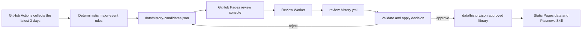

# Piasnews Requirements

Chinese version: [requirements.zh-CN.md](requirements.zh-CN.md)

Documentation sync rule: whenever this requirements document changes, update the Chinese version in the same change so both versions stay aligned.

## 1. Background

Piasnews is a reusable Agent Skill for Oscar Piastri news collection. It should let F1 fans install the skill into their own agents and fetch recent Oscar Piastri information without consuming our model tokens or private API quotas by default.

The design follows the AI HOT pattern:

- A lightweight Skill acts as the agent-facing entry point.
- Public sources are used first, without requiring users to install a private MCP server.
- Future static JSON/RSS or API endpoints can be added without rewriting the Skill.
- Optional enhanced sources, such as X, are supported only when the user provides their own credentials or the project configures its own access.

## 2. Goals

- Provide a `piasnews` Skill that can be installed from GitHub by fans using Codex, Claude Code, OpenCode, or similar agent environments.
- Fetch, deduplicate, classify, and summarize Oscar Piastri related news.
- Restrict all searches to the latest 3 days.
- Start with V0.5 as a no-backend Skill and leave a clean upgrade path to V1 static data and V2 hosted API.
- Avoid consuming our model tokens by default.
- Avoid consuming our paid third-party API quotas by default.
- Maintain documentation in the GitHub repository alongside the Skill.
- Maintain an X / Instagram account-source list and generate a social-update feed after access is configured.
- Support future daily statistics, including the number of new items discovered per day.

## 3. Non-Goals

- Do not build a full hosted backend in V0.5.
- Do not require a paid news API key in V0.5.
- Do not require X API access in V0.5.
- Do not scrape private, login-only, paywalled, or restricted content.
- Do not store full copyrighted articles. Store only metadata, short summaries, and source links.
- Do not claim rumors as confirmed news.

## 4. Version Plan

### V0.5: Skill-only MVP

The first version contains only Skill instructions and source documentation.

Expected files:

```text
README.md
piasnews/
├── SKILL.md
├── agents/
│   └── openai.yaml
└── references/
    └── sources.md
docs/
├── requirements.md
└── requirements.zh-CN.md
```

Behavior:

- Use official and public web sources directly from the user's agent environment.
- Search only the latest 3 days; do not expand to older results when the 3-day window is empty.
- Prefer official sources when available.
- Use news RSS/search fallback for broader coverage.
- Return a concise Chinese news brief by default.
- Support English output when the user asks in English.
- Clearly mark rumors, unverified reports, and non-official sources.
- Support a Chinese/English website switch. Chinese mode should prefer Chinese titles and Chinese summaries.
- Support short, daily, and fan-source tabs. Daily mode merges the useful structure from the previous standard and deep modes; fan sources shows collected X / Instagram posts and reposts.

V0.5 should already use the same conceptual data shape planned for V1/V2, so future upgrades only change the data source, not the user-facing behavior.

Current implementation status:

- `README.md` exists with bilingual Chinese/English project documentation.
- `piasnews/SKILL.md` exists.
- `piasnews/references/sources.md` exists.
- `piasnews/agents/openai.yaml` exists for Codex UI metadata.
- Search rules now enforce a latest-3-days window.
- Source strategy now separates direct official sources from RSS-discovered media sources.
- Static data generation is available through `scripts/fetch_piasnews.py`.
- `data/items.json`, `data/daily.json`, `data/rss.xml`, and schema-v2 `data/history.json` exist.
- GitHub Actions scheduled refresh is configured in `.github/workflows/update-piasnews.yml`.
- A GitHub Pages publishing entrypoint has been added for `https://znonymity.github.io/piasnews/`.
- `public/` implements a public fan daily with short, daily, and fan-source tabs, a top-right language switch, and separate visible refresh times for news data and X / IG fan-source data.
- `piasnews/references/history.md`, `piasnews/references/history-retrieval.json`, and `scripts/validate_history.py` support maintenance, review, and validation of the Looking Back knowledge base.
- `public/admin/` implements the static console; `worker/` provides deployable review and anonymous-analytics endpoints, but the external Worker, D1 binding, secrets, and public URL are not configured yet.

### V1: Static JSON/RSS Data

V1 adds scheduled collection through GitHub Actions or another low-cost scheduler. This is implemented.

Expected additional files:

```text
scripts/
└── fetch_piasnews.py
data/
├── items.json
├── daily.json
├── rss.xml
└── history.json
.github/
└── workflows/
    └── update-piasnews.yml
```

Behavior:

- Scheduled job fetches public sources every six hours, with a second backup cron ten minutes later. This is a low-cost GitHub Actions fallback rather than a stateful missed-run detector; duplicate runs are safe because unchanged data produces no commit.
- Generated static JSON/RSS is committed to the repository, published through GitHub Pages, and still readable directly from GitHub raw.
- The Skill first attempts to read static data, then falls back to direct source fetching.
- Daily item counts are generated and persisted.
- Pending and completed review records live in `data/history-candidates.json`, approved events only live in `data/history.json`, and retrieval policy lives in `piasnews/references/history-retrieval.json`; all three are published with the Pages artifact.

### V1.1: History Review Console

The V1 review console uses GitHub JSON as the review business-data store, GitHub Actions as the trusted write executor, GitHub Pages as the static frontend, and a Worker as the authentication and workflow-dispatch layer. Review data itself does not require a database; the later D1 binding stores anonymous page-view rows only and never candidate or review content.

Candidate flow:



Component responsibilities:

- `scripts/build_history_candidates.py`: runs deterministic rules after collection without an LLM. It favors championships, wins, podiums, poles, records, major contracts/team moves, and formal rulings; predictions, routine interviews, rumors, and market-value discussion are excluded by default.
- `data/history-candidates.json`: stores pending, approved, and rejected review records for deduplication and audit history.
- `public/admin/`: reads the queue and supports status filtering, Chinese title and summary review, approval, and rejection. Original titles and sources are read-only, while historical value and semantic fields are system-maintained.
- `worker/`: validates origin and an admin key, then dispatches a GitHub workflow; it stores no business data.
- `.github/workflows/review-history.yml`: invokes `scripts/review_history.py`, validates JSON, commits the decision, and immediately redeploys Pages.
- `data/history.json`: contains approved events only and is the sole maintained history source for Looking Back.

Security rules:

- Keep the GitHub token in Worker secrets only. Never place it in frontend files, repository variables, or commit history.
- The browser may persist the Worker URL locally; keep the admin key in `sessionStorage` only.
- V1 uses one high-entropy shared admin key. Upgrade to Cloudflare Access or GitHub App/OAuth for multiple reviewers.
- Review data never enters D1; Git commits continue to provide the review audit trail.

Review-database triggers include multi-reviewer authorization, community submissions, tens of thousands of candidates, or complex permission auditing. A few hundred historical vectors can still use static JSON/index files without a vector database.

### V1.2: Public Fan Daily

The GitHub Pages root serves a read-only daily report for all fans. Report content remains fully static and uses no online model service; the optional analytics backend only counts anonymous views.

- The page provides short, daily, and fan-source tabs. Short and daily align with the Skill's report modes; fan sources reads the generated X / Instagram social-update feed.
- The page provides a top-right Chinese / English switch. Chinese mode prefers `title_zh` and `summary_zh`; when a Chinese title exists, the article link text should use that Chinese title while the original English title remains available for traceability.
- Short and daily read the same `data/items.json`, `data/daily.json`, and approved `data/history.json`; news data is not duplicated. Fan sources reads `data/social.json` and renders social entries with `source_type=x|instagram`.
- The page reads `data/calendar.json` for the next Grand Prix, race-week timing, and a countdown to the next session. During practice, sprint qualifying, sprint, qualifying, or the race, the timer switches to elapsed time from session start, then advances to the next session after the expected duration. Calendar metadata is outside the three-day news window and cannot fill a daily report.
- The data workflow generates `data/next-race.ics` and `data/next-weekend.ics` from the next-race calendar metadata. The public page exposes them as calendar imports for iCalendar-compatible apps, including Apple Calendar, Google Calendar, and Outlook. Import UI differs by product, but the underlying `.ics` file format is shared.
- The page displays the `generated_at` timestamp in China Standard Time and the active three-day window.
- The page displays `data/items.json.generated_at`, `data/social.json.generated_at`, and the newest retained `data/social.json.items[].published_at` in China Standard Time so news refresh, social generation, and actual fan-source freshness are not conflated.
- Short mode uses at most five bullets, omits rumor messaging when there are no rumors, and has no data panel.
- Daily mode merges the previous standard and deep modes: key points, topic grouping, official coverage, media coverage, optional rumor radar, optional Looking Back, and bottom lightweight stats. `daily_core` social sources are folded into the normal daily item flow, not rendered as a separate X/social section.
- Key Points must include only items that directly mention Oscar Piastri / Piastri / OP81. Generic F1, team, or schedule content cannot enter Key Points only because the source is trusted. Ranking should combine publish time, current session phase, race/qualifying/practice relevance, official/reliable source boosts, and rumor demotion, so stale practice items do not outrank newer session context.
- Social-item link text must include a readable content summary and cannot stop at `X post from @account`. Chinese mode should prefer a Chinese summary and may fall back to an English original-text snippet when deterministic localization is not reliable.
- Daily mode does not show source-confidence notes or next-watch points by default; it keeps a lightweight stats block at the bottom so metrics do not interrupt the report.
- The fan-source tab does not expose the backend account list. It only shows public posts and reposts collected or imported into `data/social.json`, including post text, timestamps, links, and account attribution. If no access is configured, it must not invent social updates.
- `data/social.json` may be generated by the X API, user-exported JSON, an Agent-Reach-style local collection tool, or another external workflow. External workflows must store only public post text, timestamps, links, and account attribution, not private messages, login state, expanded long threads, or non-public content.
- Oscar Piastri's Instagram account is a `daily_core` official source. Agent-Reach does not currently expose an Instagram backend; a logged-in local Chrome session can read profile-grid links and individual post/reel detail pages, including captions, `time[datetime]`, and public engagement metadata. The IG collector should use the flow `profile links -> detail page published_at/text -> latest-three-days filter -> data/social.json import`; profile-grid links alone are not enough because the homepage does not expose stable timestamps.
- `daily_core` social sources are folded into the normal daily report item flow. The daily tab must not render a separate X / social-watch section.
- The local Agent-Reach collection entrypoint is `scripts/collect_agent_reach_social.py`. It reads `piasnews/references/x-sources.json`, calls the local Agent-Reach-selected `twitter-cli user-posts` backend by default, writes `/tmp/piasnews-agent-reach-social.json`, and imports it into `data/social.json`. If `agent-reach configure --from-browser chrome` has written Twitter/X cookies to `~/.agent-reach/config.yaml`, the collector bridges them into `twitter-cli` environment variables automatically. If authentication is unavailable, it reports source failure and does not invent content.
- `fan_watch` sources are manually curated as Oscar Piastri fan sources, so their posts do not require a direct `Piastri` / `Oscar` / `OP81` keyword to enter the fan-source feed. `daily_core` non-driver sources still require direct Piastri relevance to avoid generic F1 noise.
- The recommended local Agent-Reach schedule is every three hours, with 30 recent public posts requested per account by default; race days may temporarily use a higher cadence.
- The local publish script should skip GitHub variable updates and workflow dispatches when the compact import content is unchanged, so higher-frequency collection does not create avoidable deployments.
- The local publish script must also stop before updating GitHub when no X source collected successfully, so authentication, DNS, or network failures are not presented as a fresh X / IG update.
- X collection can migrate to an always-on mini host, VPS, or external scheduler by generating compact social JSON, updating `PIASNEWS_SOCIAL_INPUT_JSON`, and triggering `Update Piasnews Data` through GitHub API. Prefer a home/always-on local environment over data-center IPs because X may apply stricter risk controls to VPS traffic.
- The fan-source tab must show one removal-on-rights-request notice above the feed; each card shows only account attribution to avoid repeated notices.
- Looking Back uses approved history only and is omitted when no same-date event qualifies.
- GitHub Actions runs `scripts/apply_immersive_translations.py` after data collection. It applies captured Immersive Translate mappings to `title_zh` and `summary_zh`, then runs deterministic auto-repair for accumulated low-risk terminology fixes. New content without a mapping keeps deterministic Chinese or English fallback text until a mapping exists. Approved manual cases are no longer default production overrides; they only mark samples for future training/evaluation. Argos remains available only as a manual fallback/evaluation tool, not as the default production translator.
- Browser-side deterministic templates render the reports without an LLM or model-token usage.
- `.github/workflows/update-piasnews.yml` packages `public/` with the current run's generated data, so the page and JSON/RSS update in the same Pages deployment. The workflow keeps both the primary schedule and the ten-minute backup schedule.
- The UI includes loading, empty, error, and manual-refresh states, responsive layouts, and keyboard-operable tabs.
- The countdown updates locally every second and targets the next session first. In-session timers count up from session start; after a session ends, the target advances to the next session. If the calendar API fails, deployment keeps the last valid committed calendar.

### V1.3: Anonymous Page Analytics

Page analytics reuses the Cloudflare Worker and uses D1 for frequent counter writes. GitHub JSON is not used for page views because committing each visit would create conflicts, noisy history, and avoidable latency.

- The fan daily reports at most once per page load. Tab changes and manual data refreshes do not add another view.
- The payload contains only page path and referrer hostname; the Worker adds the timestamp. No IP, cookie, fingerprint, or visitor ID is stored, so V1.3 reports page views rather than claiming unique visitors.
- `POST /analytics/view` is public but enforces allowed-origin and field-whitelist validation.
- `GET /analytics/summary?days=7|30` requires the admin key and returns only today/period/previous-period metrics, averages, daily trend, top paths, and referrer-site aggregates.
- The D1 binding is `ANALYTICS_DB`, the schema is `worker/migrations/0001_analytics.sql`, and raw rows have a 90-day retention window.
- The admin console adds an Analytics tab. Missing Worker configuration is shown explicitly and does not affect history review.
- GitHub Actions writes public `runtime-config.json` from the repository variable `PIASNEWS_WORKER_URL`. The URL is not a secret; the admin key remains in `sessionStorage` only.
- Analytics failures are ignored by the fan page and cannot block news, calendar, or countdown rendering.

### Pretrained Model Invocation and Artifacts

`piasnews/references/history-retrieval.json` describes the model and retrieval strategy; it does not execute a model. V1 currently keeps `embeddings.enabled=false`, so review and daily reports do not download or call a pretrained model.

When enabled, the executor must:

1. Resolve `model_id` at an immutable `model_revision` and download the model plus tokenizer.
2. Verify the recorded license, dimensions, and checksum.
3. Embed each approved event's `semantic.embedding_text`.
4. Embed the current-news topic with the same model.
5. Perform vector recall, then exact strong-facet gating and hybrid ranking. Vector similarity alone cannot establish a contextual link.

Prefer CI mode by default: GitHub Actions runs an open-weight model and publishes vectors or resolved historical links, while fan agents read static output and consume none of our model tokens. Optional local mode lets a user's own agent download the same model and compute query vectors.

Artifact placement:

- **Main GitHub repository**: code, human labels, training/evaluation splits, model metadata, license, checksum, and small vector indexes.
- **GitHub Release**: versioned downloadable assets attached to a Git tag, suitable for a small model bundle, experiment artifact, vector index, or checksum file.
- **Model repository**: a dedicated host such as Hugging Face Hub for weights, tokenizer, configuration, model card, license, and immutable revisions that model runtimes can load directly.

Prefer a model repository for a trained embedding model or reranker. Use a GitHub Release for small, simple artifacts. Piasnews config stores immutable references and checksums rather than committing large weights to normal Git history.

### V2: Hosted API

V2 adds a hosted service if the project needs stronger reliability, search, filtering, or community features.

Potential endpoints:

```text
GET /api/items
GET /api/daily
GET /api/search?q=
GET /rss.xml
```

Behavior:

- Skill first attempts `PIASNEWS_API_URL` if configured.
- API supports filtering by date, source, category, official-only, and race-week.
- API returns the same item schema used by V1 static JSON.
- The hosted API must avoid paid-token summaries unless explicitly approved.

## 5. Source Strategy

### Default Official Sources

- McLaren Formula 1 news/articles
- Oscar Piastri official news
- Formula 1 official latest news

### Public News Fallback

- Google News RSS or equivalent public search feed for:
  - `"Oscar Piastri" when:3d`
  - `"Piastri" "McLaren" when:3d`
  - `"OP81" when:3d`
  - `"Oscar Piastri" "qualifying" when:3d`
  - `"Oscar Piastri" "race" when:3d`
  - `"Oscar Piastri" "interview" when:3d`

### Optional Media Sources

Media sources are not direct crawl targets in V1. They are kept as RSS-discovered sources through Google News RSS and classified from metadata.

RSS `pubDate` is discovery metadata, not the article publication date. The collector must decode Google News links to publisher URLs, read `datePublished` or `article:published_time`, and only then apply the latest-three-days filter. Items with unresolved publisher URLs, unverifiable dates, or out-of-window original dates are excluded. Stable IDs use the normalized publisher URL and title without an RSS timestamp.

- Motorsport
- Autosport
- The Race
- RacingNews365
- PlanetF1
- ESPN F1
- Sky Sports F1
- BBC
- Motorsport Week
- GPblog
- Crash.net
- RACER
- Speedcafe

## 6. X Integration Strategy

X should be treated as an optional enhanced source, not a required dependency.

V0.5 behavior:

- Do not require X API access.
- Do not use our X API token for all users.
- If a user provides their own X access, local browser session, MCP, or bearer token, the Skill may use it in that user's environment.
- If no X access is available, the Skill continues normally with official and public news sources.

After the user provides a maintained X source list:

- Add and maintain the account list in `piasnews/references/x-sources.json`.
- Use it as a discovery guide for user-owned X / Instagram access or future V1/V2 collectors. Keep it as repository configuration; Pages publishes `data/social.json`, not the account list.
- Track daily counts separately for X-origin items.
- Store post metadata, short paraphrases, and links, not large verbatim copies.
- Every social item must include account-level attribution. Remove items promptly if a rights holder or account owner requests removal.

Current maintained account groups:

- Daily sources: Oscar Piastri X, Oscar Piastri Instagram, `@NFFormula`, `@F1`
- Fan-watch sources: `@PiastriNews`, `@NicolePiastri`, `@oscarpiastri81`, `@laurogeitabat`, `@oscarsspiastree`

## 7. Data Model

All versions should normalize items into this shape:

```json
{
  "id": "stable-source-url-or-hash",
  "title": "Article or post title",
  "title_zh": "Chinese article title",
  "url": "https://example.com/item",
  "source": "McLaren",
  "source_type": "official | media | x | rss | api",
  "source_group": "official_direct | rss_discovery | x | api",
  "published_at": "2026-06-12T10:00:00Z",
  "rss_published_at": "2026-06-12T10:05:00Z",
  "published_at_source": "publisher_metadata",
  "date_verified": true,
  "discovered_at": "2026-06-12T10:05:00Z",
  "category": "race | team | interview | contract | fan | rumor | other",
  "summary": "Short summary generated from metadata or short excerpt",
  "summary_zh": "Chinese short summary",
  "attribution": "Referenced from @account",
  "copyright_notice": "Remove on rights request.",
  "official": true,
  "verified": true,
  "tags": ["Oscar Piastri", "McLaren", "F1"],
  "language": "en",
  "daily_key": "2026-06-12"
}
```

Daily stats shape:

```json
{
  "date": "2026-06-12",
  "total_new_items": 12,
  "official_new_items": 3,
  "media_new_items": 7,
  "x_new_items": 2,
  "rumor_new_items": 1,
  "sources": {
    "McLaren": 1,
    "Formula1": 2,
    "X": 2
  }
}
```

Historical events separate factual data, human review signals, and machine-maintained semantic fields. New records remain `pending` in `data/history-candidates.json`; approval copies them into the approved-only `data/history.json`:

```json
{
  "id": "piastri-2024-07-21-first-grand-prix-win",
  "date": "2024-07-21",
  "month_day": "07-21",
  "year": 2024,
  "title": "Oscar Piastri wins his first Formula 1 Grand Prix in Hungary",
  "title_zh": "Oscar Piastri 在匈牙利赢得首个 F1 大奖赛冠军",
  "summary": "Short factual summary.",
  "summary_zh": "Piastri 在匈牙利赢得个人首个 F1 大奖赛冠军。",
  "type": "race_win",
  "source": "Formula 1 results",
  "url": "https://www.formula1.com/en/results/2024/races/1239/hungary/race-result",
  "candidate": {
    "status": "pending",
    "score": 100,
    "signals": ["manual_seed", "verified_historical_source"]
  },
  "selection": {
    "review_status": "pending",
    "include": null,
    "historical_value": 100,
    "inclusion_reason_zh": null
  },
  "semantic": {
    "event_kind": "race_result",
    "themes": ["first Grand Prix win", "team orders"],
    "round": "Hungarian Grand Prix",
    "circuit": "Hungaroring",
    "session": "race",
    "outcome": "first Formula 1 Grand Prix victory",
    "strong_keys": ["first_grand_prix_win", "hungarian_grand_prix", "team_orders"],
    "embedding_text": "A self-contained factual sentence."
  }
}
```

Candidate rules use event type, official-source status, first-or-record signals, and source coverage to assign `70` (worth keeping), `85` (important milestone), or `100` (iconic event). This internal value controls Looking Back eligibility and later ranking or training supervision; it appears in neither the review form nor fan daily reports. Human approval or rejection remains the final admission gate. Routine interviews and announcements are excluded by default, while an iconic social post can qualify through lasting impact.

Historical retrieval uses one `Looking Back` section. Candidates may be exact same-month/day anniversaries or events strongly related to today's main topic. A contextual candidate must match at least one precise strong semantic facet; broad tags such as `F1`, `McLaren`, `race`, or `street circuit` cannot qualify on their own.

## 8. Output Requirements

Default reports use two modes:

### Short Mode

Use up to 5 bullets for quick checks:

```markdown
# Piasnews Quick Brief

- Most worth reading: ...
- Official update: ...
- Rumor reminder: ...
```

Omit the rumor reminder when there are no rumor or unverified items. Do not include a data panel in short mode.

### Daily Mode

Default fan-daily format:

```markdown
# Piasnews Fan Daily

## Key Points
- 2-3 high-signal points, official and reliable sources first.

## Topic Merge
- Group similar coverage by race, team, interview, rumor, and other categories.

## Official Updates
1. [Title](url) - Source, time
   Short summary.

## Media Coverage
1. [Title](url) - Source, time
   Short summary.

## X / Social Updates
Only show this section when X data is available.

## Rumor Radar
Only show this section when rumors or unverified items exist.

## Looking Back
Show at most one approved event from `data/history.json`. Exact-date anniversaries and strongly related history share this section. Omit it when no event passes the review, historical-value, and relevance gates.
```

Language behavior:

- Use Chinese by default when the user asks in Chinese.
- Use English when the user asks in English.
- Chinese web mode uses Chinese titles as link text by default and keeps the original English title as traceability metadata. English web mode uses original titles.
- Summaries should use the selected language.
- Keep data out of short and daily fan reports by default so the daily report does not feel redundant.

## 9. GitHub Synchronization

Current repository state:

- Local repo path: `/Users/bytedance/Documents/piasnews`
- Git is initialized locally.
- GitHub remote: `https://github.com/ZnonYmitY/piasnews.git`

Required sync flow:

1. Commit documentation, Skill, script, and data changes.
2. Push to GitHub.
3. Use GitHub as the install source for the Skill.

Suggested branch strategy:

- `main`: stable installable Skill.
- `codex/*`: implementation and documentation branches.

Current repository layout:

```text
/
├── .github/
│   └── workflows/
│       ├── review-history.yml
│       └── update-piasnews.yml
├── README.md
├── data/
│   ├── calendar.json
│   ├── daily.json
│   ├── history-candidates.json
│   ├── history.json
│   ├── items.json
│   └── rss.xml
├── docs/
│   ├── requirements.md
│   └── requirements.zh-CN.md
├── piasnews/
│   ├── agents/
│   │   └── openai.yaml
│   ├── SKILL.md
│   └── references/
│       ├── history-retrieval.json
│       ├── history.md
│       └── sources.md
├── public/
│   ├── app.js
│   ├── index.html
│   ├── styles.css
│   ├── admin/
│   │   ├── app.js
│   │   ├── index.html
│   │   └── styles.css
├── scripts/
│   ├── build_history_candidates.py
│   ├── fetch_f1_calendar.py
│   ├── fetch_piasnews.py
│   ├── review_history.py
│   └── validate_history.py
├── tests/
│   ├── test_f1_calendar.py
│   ├── test_fetch_piasnews.py
│   └── test_history_pipeline.py
└── worker/
    ├── src/
    │   └── index.js
    ├── README.md
    └── wrangler.toml.example
```

## 10. Acceptance Criteria

V0.5 is complete when:

- `piasnews/SKILL.md` exists and follows Skill format with valid frontmatter.
- `piasnews/agents/openai.yaml` exists for Codex UI metadata.
- `piasnews/references/sources.md` lists official, fallback, and optional sources.
- Searches are restricted to the latest 3 days.
- The Skill can answer prompts such as:
  - "今天 Oscar Piastri 有什么新闻？"
  - "只看官方来源，整理 Piastri 最近动态。"
  - "Summarize the latest Oscar Piastri news in English."
- The Skill works without our API key, X token, or hosted backend.
- The Skill explains source limitations instead of inventing missing news.
- The output clearly distinguishes official news, media coverage, and rumors.

V1 is complete when:

- Scheduled collection generates `items.json`, `daily.json`, `rss.xml`, and `calendar.json`.
- The Skill reads static data first and falls back to direct sources.
- Daily new item counts are available.
- GitHub Pages publishes the static data entrypoint.
- The GitHub Pages root publishes the short, daily, and fan-source tabs, displays separate news and X / IG fan-source refresh times, and updates after each collection workflow.
- Short and daily share static news data, fan sources reads the `data/social.json` update feed, and page rendering uses no LLM; short has no data panel, while daily keeps lightweight stats at the bottom.
- The page displays the next F1 race countdown, China Standard Time schedule, official calendar link, and next-race / next-weekend iCalendar import links; calendar data refreshes with the collection workflow.
- `data/history.json` is available for optional historical context and is published with Pages.
- Unreviewed events never enter Looking Back; vector embeddings remain optional and are disabled by default.
- The review console reads pending records, confirms Chinese content, and submits approval or rejection; candidate rules assign historical value automatically.
- The static frontend never receives a GitHub token; the Worker dispatches the controlled workflow.
- Automatic nomination uses no LLM and does not repeatedly nominate sources already rejected.
- The public daily can report anonymous page views, and the admin console can display 7/30-day aggregates without storing IP addresses, cookies, or visitor identifiers.
- Local Immersive Translate capture is available as an optional no-LLM enhancement: after syncing GitHub data, the local runner builds a workbench, opens Chrome only when missing translation targets exist, captures translated DOM mappings, and can optionally commit/push the mapping and trigger the data workflow.

V2 is complete when:

- Hosted API returns the same schema as V1.
- Skill can use `PIASNEWS_API_URL` when configured.
- API remains optional; users can still run the Skill without it.

## 11. Open Questions

- Should the default Skill output use simplified Chinese, traditional Chinese, or match the user's language automatically?
- V1 now publishes through GitHub Pages under this repository.
- Who will own the final public review-Worker URL and Cloudflare account?
- Should the project name be displayed as `Piasnews`, `piasnews`, or `PIASNEWS` in user-facing output?
