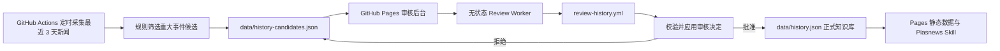

# Piasnews 需求文档

英文版：[requirements.md](requirements.md)

文档同步规则：后续每次修改需求文档时，需要同时更新英文版和中文版，保证两份文档内容一致。

## 1. 背景

Piasnews 是一个面向 Oscar Piastri 新闻收集的可复用 Agent Skill。目标是让 F1 车迷可以把这个 Skill 安装到自己的 Agent 中，抓取 Oscar Piastri 的最新信息，同时默认不消耗我们的模型 token 或私有 API 额度。

整体设计参考 AI HOT 模式：

- 轻量 Skill 作为 Agent 入口。
- 优先使用公开信息源，不要求用户安装私有 MCP server。
- 后续可以平滑接入静态 JSON/RSS 或 API，不需要重写 Skill。
- X 等增强源只作为可选能力，在用户提供自己的凭证或我们维护好来源列表后再接入。

## 2. 目标

- 提供一个可从 GitHub 安装的 `piasnews` Skill，支持 Codex、Claude Code、OpenCode 等 Agent 环境。
- 抓取、去重、分类并总结 Oscar Piastri 相关新闻。
- 所有搜索限制在最近 3 天内。
- 先以 V0.5 无后端 Skill 版本启动，同时保留升级到 V1 静态数据和 V2 托管 API 的路径。
- 默认不消耗我们的模型 token。
- 默认不消耗我们的付费第三方 API 额度。
- 在 GitHub 仓库中维护 Skill 和对应文档。
- 支持后续接入用户提供的 X 账号/来源库。
- 支持后续统计每日新增信息数量。

## 3. 非目标

- V0.5 不建设完整托管后端。
- V0.5 不依赖付费新闻 API key。
- V0.5 不强制依赖 X API。
- 不抓取私密、登录后可见、付费墙或受限制内容。
- 不存储完整版权文章，只保存元数据、短摘要和来源链接。
- 不把传闻当作已确认新闻。

## 4. 版本规划

### V0.5：纯 Skill MVP

第一版只包含 Skill 指令和来源说明文档。

预期文件：

```text
README.md
piasnews/
├── SKILL.md
├── agents/
│   └── openai.yaml
└── references/
    └── sources.md
docs/
├── requirements.md
└── requirements.zh-CN.md
```

行为：

- 从用户自己的 Agent 环境直接访问官方和公开网页来源。
- 只搜索最近 3 天；当 3 天窗口内没有结果时，不扩展到更早内容。
- 优先使用官方来源。
- 用新闻 RSS / 搜索作为覆盖补充。
- 默认返回简洁中文新闻简报。
- 用户用英文提问时支持英文输出。
- 明确标注传闻、未验证报道和非官方来源。
- 粉丝日报支持速读版、标准版和深读版三种输出长度。

V0.5 需要提前采用 V1/V2 规划中的统一数据结构。这样后续升级时主要替换数据来源，不改变用户侧体验。

当前实现状态：

- `README.md` 已存在，包含中英双语项目说明。
- `piasnews/SKILL.md` 已存在。
- `piasnews/references/sources.md` 已存在。
- `piasnews/agents/openai.yaml` 已存在，用于 Codex UI 元数据。
- 搜索规则已强制限制为最近 3 天。
- 来源策略已拆分为官方直查源和 RSS 发现型媒体源。
- `scripts/fetch_piasnews.py` 已支持静态数据生成。
- `data/items.json`、`data/daily.json`、`data/rss.xml` 和 schema v2 `data/history.json` 已存在。
- `.github/workflows/update-piasnews.yml` 已配置 GitHub Actions 定时刷新。
- GitHub Pages 发布入口已添加，数据将发布到 `https://znonymity.github.io/piasnews/`。
- `piasnews/references/history.md`、`piasnews/references/history-retrieval.json` 和 `scripts/validate_history.py` 已存在，用于维护、审核和校验“往日回顾”知识库。
- `public/admin/` 已实现静态审核台；`worker/` 已提供可部署的无状态审核接口，但尚未配置外部 Worker 密钥和公开 URL。

### V1：静态 JSON/RSS 数据

V1 增加通过 GitHub Actions 或其他低成本调度器定时采集。当前已实现。

预期新增文件：

```text
scripts/
└── fetch_piasnews.py
data/
├── items.json
├── daily.json
├── rss.xml
└── history.json
.github/
└── workflows/
    └── update-piasnews.yml
```

行为：

- 定时任务抓取公开来源。
- 生成静态 JSON/RSS，并提交到仓库；同时通过 GitHub Pages 发布，也可直接从 GitHub raw 读取。
- Skill 优先读取静态数据，失败后再回退到直接抓取来源。
- 生成并保存每日新增数量统计。
- 待审和已处理候选存放在 `data/history-candidates.json`，只有批准事件进入 `data/history.json`；检索策略存放在 `piasnews/references/history-retrieval.json`，三者随 Pages artifact 一起发布。

### V1.1：历史审核后台

V1 审核后台使用 GitHub JSON 作为业务数据仓库、GitHub Actions 作为可信写入执行器、GitHub Pages 作为静态前端、无状态 Worker 作为鉴权与工作流触发层。当前数据量和单人审核模式不需要数据库。

候选流程：



组件职责：

- `scripts/build_history_candidates.py`：在每次采集后执行确定性规则筛选，不调用大模型。优先提名冠军、胜利、领奖台、杆位、纪录、重大合同/车队变动和正式裁决；预测、普通采访、传闻和市场价值讨论默认排除。
- `data/history-candidates.json`：保存待审、已批准和已拒绝记录，作为去重与审核审计来源。
- `public/admin/`：读取候选队列，支持筛选状态、确认中文标题与摘要并批准或拒绝。原始标题和来源只读展示，历史价值与语义字段均由系统维护。
- `worker/`：校验来源域名和管理员密钥，将审核内容编码后触发 GitHub workflow；不保存业务数据。
- `.github/workflows/review-history.yml`：调用 `scripts/review_history.py`，验证 JSON、提交审核结果并立即重新部署 Pages。
- `data/history.json`：只包含人工批准事件，是“往日回顾”唯一正式历史来源。

安全规则：

- GitHub Token 只能保存在 Worker Secret，不能进入前端文件、仓库变量或提交历史。
- Worker URL 可以保存在浏览器本地；管理员密钥只保存在 `sessionStorage`。
- V1 单人审核使用共享高强度管理员密钥。多审核员版本再升级为 Cloudflare Access 或 GitHub App/OAuth。
- Worker 无状态，Git 提交历史承担审核日志，因此当前不需要数据库。

数据库触发条件：多审核员权限、社区投稿、数万级候选、复杂运营统计或高频在线向量服务。即使只有几百条历史向量，也可以继续使用静态 JSON/索引，不必为向量检索单独引入数据库。

### 预训练模型调用与产物

`piasnews/references/history-retrieval.json` 只描述模型和检索策略，本身不会执行模型。当前 `embeddings.enabled=false`，所以 V1 审核和日报都不会下载或调用预训练模型。

未来启用时，执行脚本需要：

1. 根据 `model_id` 和不可变 `model_revision` 下载模型及 tokenizer。
2. 校验许可证、维度和 SHA-256 等记录。
3. 对正式历史事件的 `semantic.embedding_text` 生成向量。
4. 用同一个模型对今日新闻主题生成查询向量。
5. 先做向量召回，再执行强语义字段门槛和混合排序；向量相似不能单独建立关联。

推荐默认采用 CI 模式：GitHub Actions 运行开放权重模型并发布向量或已解析的历史关联，粉丝 Agent 只读取静态结果，因此不消耗我们的模型 Token。可选本地模式由用户自己的 Agent 下载同一模型并计算查询向量。

模型产物存放规则：

- **GitHub 主仓库**：代码、人工标注、训练/评测切分、模型 ID、版本、许可证、校验值和小型向量索引。
- **GitHub Release**：与 Git tag 绑定的一组可下载附件，适合小型模型包、单次实验产物、向量索引或校验文件。
- **模型仓库**：Hugging Face Hub 等专用模型托管，适合包含权重、tokenizer、配置、模型卡、许可证和不可变 revision 的正式 embedding/reranker 模型。

训练后的 embedding 或 reranker 优先放模型仓库；体积小、结构简单的产物可放 GitHub Release。Piasnews 配置只保存不可变下载引用和校验值，不把大型权重直接提交进 Git 历史。

### V2：托管 API

如果项目需要更强的稳定性、搜索、筛选或社区能力，V2 再增加托管服务。

潜在接口：

```text
GET /api/items
GET /api/daily
GET /api/search?q=
GET /rss.xml
```

行为：

- 如果配置了 `PIASNEWS_API_URL`，Skill 优先使用该 API。
- API 支持按日期、来源、分类、是否官方、比赛周等条件筛选。
- API 返回与 V1 静态 JSON 相同的数据结构。
- 除非明确批准，否则托管 API 不使用付费 token 生成摘要。

## 5. 来源策略

### 默认官方来源

- McLaren Formula 1 新闻 / 文章
- Oscar Piastri 官方新闻
- Formula 1 官方最新新闻

### 公开新闻补充

- Google News RSS 或等价公开搜索 Feed，查询词包括：
  - `"Oscar Piastri" when:3d`
  - `"Piastri" "McLaren" when:3d`
  - `"OP81" when:3d`
  - `"Oscar Piastri" "qualifying" when:3d`
  - `"Oscar Piastri" "race" when:3d`
  - `"Oscar Piastri" "interview" when:3d`

### 可选媒体来源

媒体来源在 V1 中不是直抓目标，而是通过 Google News RSS 发现，并根据元数据分类。

RSS 的 `pubDate` 只代表发现侧时间，不能作为原文发布日期。采集器必须解析 Google News 跳转到原站，读取 `datePublished` 或 `article:published_time`，再执行最近 3 天过滤。无法解析原站 URL、无法核验发布日期或原文已超期的条目必须排除。稳定 ID 使用规范化原站 URL 与标题生成，不包含 RSS 时间。

- Motorsport
- Autosport
- The Race
- RacingNews365
- PlanetF1
- ESPN F1
- Sky Sports F1
- BBC
- Motorsport Week
- GPblog
- Crash.net
- RACER
- Speedcafe

## 6. X 接入策略

X 应作为可选增强源，而不是必需依赖。

V0.5 行为：

- 不要求 X API 访问权限。
- 不使用我们的 X API token 为所有用户抓取。
- 如果用户提供自己的 X 访问方式、本地浏览器登录态、MCP 或 bearer token，Skill 可以在该用户环境中使用。
- 如果没有 X 访问能力，Skill 仍然通过官方和公开新闻来源正常工作。

用户后续提供维护好的 X 来源列表后：

- 新增 `piasnews/references/x-sources.md`。
- 该文件作为用户自有 X 访问或未来 V1/V2 采集器的发现指南。
- 单独统计 X 来源的每日新增数量。
- 只保存 post 元数据和链接，不保存大段原文。

初始候选账号分组：

- 官方账号：Oscar Piastri、McLaren F1、Formula 1
- 车队和车手相关账号
- 可信 F1 记者和媒体账号
- 粉丝账号仅在人工确认后加入

## 7. 数据模型

所有版本都应把新闻条目规范成以下结构：

```json
{
  "id": "stable-source-url-or-hash",
  "title": "Article or post title",
  "url": "https://example.com/item",
  "source": "McLaren",
  "source_type": "official | media | x | rss | api",
  "source_group": "official_direct | rss_discovery | x | api",
  "published_at": "2026-06-12T10:00:00Z",
  "rss_published_at": "2026-06-12T10:05:00Z",
  "published_at_source": "publisher_metadata",
  "date_verified": true,
  "discovered_at": "2026-06-12T10:05:00Z",
  "category": "race | team | interview | contract | fan | rumor | other",
  "summary": "Short summary generated from metadata or short excerpt",
  "official": true,
  "verified": true,
  "tags": ["Oscar Piastri", "McLaren", "F1"],
  "language": "en",
  "daily_key": "2026-06-12"
}
```

每日统计结构：

```json
{
  "date": "2026-06-12",
  "total_new_items": 12,
  "official_new_items": 3,
  "media_new_items": 7,
  "x_new_items": 2,
  "rumor_new_items": 1,
  "sources": {
    "McLaren": 1,
    "Formula1": 2,
    "X": 2
  }
}
```

历史事件采用事实、人工审核信号和机器维护的语义字段三层。`data/history-candidates.json` 中的新候选默认保持 `pending`；批准后复制到只包含正式事件的 `data/history.json`：

```json
{
  "id": "piastri-2024-07-21-first-grand-prix-win",
  "date": "2024-07-21",
  "month_day": "07-21",
  "year": 2024,
  "title": "Oscar Piastri wins his first Formula 1 Grand Prix in Hungary",
  "title_zh": "Oscar Piastri 在匈牙利赢得首个 F1 大奖赛冠军",
  "summary": "Short factual summary.",
  "summary_zh": "Piastri 在匈牙利赢得个人首个 F1 大奖赛冠军。",
  "type": "race_win",
  "source": "Formula 1 results",
  "url": "https://www.formula1.com/en/results/2024/races/1239/hungary/race-result",
  "candidate": {
    "status": "pending",
    "score": 100,
    "signals": ["manual_seed", "verified_historical_source"]
  },
  "selection": {
    "review_status": "pending",
    "include": null,
    "historical_value": 100,
    "inclusion_reason_zh": null
  },
  "semantic": {
    "event_kind": "race_result",
    "themes": ["first Grand Prix win", "team orders"],
    "round": "Hungarian Grand Prix",
    "circuit": "Hungaroring",
    "session": "race",
    "outcome": "first Formula 1 Grand Prix victory",
    "strong_keys": ["first_grand_prix_win", "hungarian_grand_prix", "team_orders"],
    "embedding_text": "A self-contained factual sentence."
  }
}
```

候选生成规则根据事件类型、官方来源、首次或纪录信号和多源覆盖，自动写入未来参考价值：`70`（值得保留）、`85`（重要节点）或 `100`（标志事件）。它是未来“往日回顾”准入、排序调优和训练监督信号，不进入审核表单，也不在粉丝日报中外显。人工批准或拒绝仍是最终入库门槛；普通采访和常规公告默认不收录，具有长期影响的标志性社媒事件可以收录。

历史检索统一输出为“往日回顾”：候选既可以来自同月同日，也可以来自与今日主线高度相关的历史事件。关联候选必须至少命中一个精确强语义字段；`F1`、`McLaren`、`比赛`、`街道赛`等宽泛标签不能单独构成关联。

## 8. 输出要求

默认报告格式采用三种模式：

### 速读版

最多 5 条，适合快速确认是否有大事：

```markdown
# Piasnews 速读

- 最值得看：...
- 官方动态：...
- 传闻提醒：...
```

没有传闻或未验证信息时省略传闻提醒。速读版不展示数据面板。

### 标准版

默认粉丝日报格式：

```markdown
# Piasnews 粉丝日报

## 今日重点
- 2-3 条高价值看点，官方和高可信来源优先。

## 官方动态
1. [标题](url) - 来源，时间
   简短摘要。

## 媒体报道
1. [标题](url) - 来源，时间
   简短摘要。

## X / 社交动态
仅在 X 数据可用时展示。

## 传闻雷达
仅在存在传闻或未验证信息时展示。

## 往日回顾
最多展示一条来自 `data/history.json` 的已审核事件。同日纪念与强关联历史使用同一栏目；没有满足审核、热度和相关性门槛的事件时省略。
```

### 深读版

使用独立深读格式，不使用泛泛的“今日一句”开场：

- 今日重点：2-3 条高价值看点。
- 话题合并：把同一事件的多家媒体报道合并成话题卡。
- 官方动态：有官方信息时单独列出。
- 来源可信度：区分官方、主流媒体、聚合源和低可信来源。
- 明日关注：基于当前信息列出未来 24-48 小时值得关注的线索。
- 往日回顾：合并同日纪念和强关联历史，只展示人工审核通过的事件。
- 数据面板：只在深读版或用户要求统计时展示。

语言策略：

- 用户用中文提问时默认使用中文。
- 用户用英文提问时使用英文。
- 原始标题有价值时可以保留，但摘要应使用用户提问语言。
- 速读版和标准版不展示数据面板，避免让日报显得冗余。

## 9. GitHub 同步

当前仓库状态：

- 本地仓库路径：`/Users/bytedance/Documents/piasnews`
- 本地已初始化 Git。
- GitHub remote：`https://github.com/ZnonYmitY/piasnews.git`

同步流程：

1. 提交文档、Skill、脚本和数据变更。
2. 推送到 GitHub。
3. 使用 GitHub 作为 Skill 安装源。

建议分支策略：

- `main`：稳定可安装 Skill。
- `codex/*`：实现和文档分支。

当前仓库结构：

```text
/
├── .github/
│   └── workflows/
│       ├── review-history.yml
│       └── update-piasnews.yml
├── README.md
├── data/
│   ├── daily.json
│   ├── history-candidates.json
│   ├── history.json
│   ├── items.json
│   └── rss.xml
├── docs/
│   ├── requirements.md
│   └── requirements.zh-CN.md
├── piasnews/
│   ├── agents/
│   │   └── openai.yaml
│   ├── SKILL.md
│   └── references/
│       ├── history-retrieval.json
│       ├── history.md
│       └── sources.md
├── public/
│   ├── admin/
│   │   ├── app.js
│   │   ├── index.html
│   │   └── styles.css
│   └── index.html
├── scripts/
│   ├── build_history_candidates.py
│   ├── fetch_piasnews.py
│   ├── review_history.py
│   └── validate_history.py
├── tests/
│   └── test_history_pipeline.py
└── worker/
    ├── src/
    │   └── index.js
    ├── README.md
    └── wrangler.toml.example
```

## 10. 验收标准

V0.5 完成标准：

- `piasnews/SKILL.md` 存在，并包含合法 Skill frontmatter。
- `piasnews/agents/openai.yaml` 存在，用于 Codex UI 元数据。
- `piasnews/references/sources.md` 列出官方、补充和可选来源。
- 搜索限制在最近 3 天内。
- Skill 能回答以下提示：
  - "今天 Oscar Piastri 有什么新闻？"
  - "只看官方来源，整理 Piastri 最近动态。"
  - "Summarize the latest Oscar Piastri news in English."
- Skill 无需我们的 API key、X token 或托管后端即可运行。
- Skill 在信息源受限时说明限制，不编造新闻。
- 输出能清楚区分官方新闻、媒体报道和传闻。

V1 完成标准：

- 定时采集生成 `items.json`、`daily.json` 和 `rss.xml`。
- Skill 优先读取静态数据，失败后回退到直接来源。
- 每日新增信息数量可查询。
- GitHub Pages 发布静态数据入口。
- `data/history.json` 可用于可选历史事件上下文，并随 Pages 发布。
- 未审核事件不会进入“往日回顾”；向量模型为可选依赖，当前默认关闭。
- 审核后台可以读取待审队列、确认中文内容并提交批准/拒绝；历史价值由候选规则自动生成。
- GitHub Token 不出现在静态前端，审核请求通过无状态 Worker 触发受控 workflow。
- 自动候选流程不调用大模型，并能避免重复提名已拒绝来源事件。

V2 完成标准：

- 托管 API 返回与 V1 相同的数据结构。
- Skill 可在配置 `PIASNEWS_API_URL` 时使用 API。
- API 仍然是可选项；用户没有 API 也能运行 Skill。

## 11. 待确认问题

- 默认 Skill 输出使用简体中文、繁体中文，还是自动匹配用户语言？
- 第一批 X 来源账号包含哪些？
- V1 已通过当前仓库的 GitHub Pages 发布。
- 审核 Worker 的最终公开 URL 和 Cloudflare 账号由谁维护？
- 用户侧展示名使用 `Piasnews`、`piasnews` 还是 `PIASNEWS`？
